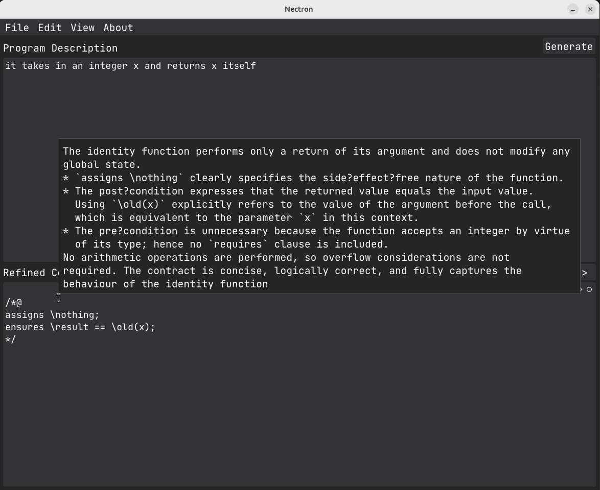

<p align="center">
    
</p>

This is the official implementation of the Nectron system, introduced in the paper titled:

**Nectron: Neurosymbolic Implementation-Free Contracts Generation**

By Authors: Mohamed Amine Layachi and Khaoula Boukir from Ibn Tofail University, Kenitra, Morocco.

## Abstract

Formal verification is a demanding and labor-intensive task that requires a lot of domain expertise in order to formally verify the correctness of software code. While different specification synthesis methods have been proposed, they often trade-off preciseness for interpretability and scalability. This paper proposes a novel Neurosymbolic approach that combines large language models (LLMs) with a custom symbolic engine to generate ACSL-annotated function contracts using only a natural description of a program’s behavior without any implementation. This is achieved by designing a proxy-task that is represented by a formal language which links neural and symbolic components; instances of this language are converted by the symbolic engine into contract seeds, which are further refined by an LLM-based multi-layer refinement block. The system shows a significant performance increase over zero-shot approaches by 26.58%, setting a baseline benchmark using a novel evaluation framework introduced in the paper. The results suggest that the approach can reduce the reliance on model size and address LLMs’ limitations caused by insufficient data, while also making the generation process more precise, interpretable, and scalable.

## Technical Overview

When using the Nectron system, one should be aware of three main components:

1. The Nectron Abstract Representation (NAR), a formal language that the LLM uses to abstractly describe the behavior of the program.
2. The Symbolic Engine, which takes in the abstract representation and symbolically generates contract seeds in ACSL.
3. The Refinement Block, which takes in the generated contract seeds refine them over multiple layers to get a more complete set of ACSL contracts.

## The Project's Structure

| Component        | File                                                                        | Description                                                                                                  |
|------------------|-----------------------------------------------------------------------------|--------------------------------------------------------------------------------------------------------------|
| NAR              | nar_grammar/nar.lark                                                        | The lark file that defines the grammar of NAR.                                                               |
| Symbolic Engine  | scripts/pyramid.py                                                          | The implementation of the symbolic engine.                                                                   |
|                  | scripts/parseclasses.py                                                     | Implements many classes used to parse specific operations of NAR.                                            |
|                  | scripts/nar_parsers.py                                                      | Implements the parsers for NAR blocks (var, action, return).                                                 |
|                  | scripts/pyramid_exceptions.py                                               | Implements some basic exceptions for the symbolic engine.                                                    |
| Refinement Block | scripts/nectron_gemini.py                                                   | Implements all LLM interaction layers via Google Gemini's API.                                               |
|                  | scripts/nectron_openai.py                                                   | Implements all LLM interaction layers via OpenAI's API (uses OpenRouter's services).                         |
| Nectron System   | scripts/nectron.py                                                          | Implements the Nectron system with all of its components.                                                    |
|                  | scripts/app.py (with macros.py, utilties.py, settings.json, and app_assets) | Implements the GUI-tool that allows users to interact with the Nectron system.                               |
| Evaluator        | eval.py                                                                     | Implements two main classes: NectronInferrer and NectronEvaluator that are both used to evaluate the system. |
| CLI              | main.py                                                                     | Implements a CLI that one can use to run either the gui-tool (app), inference, or evaluation.                |


The implementation is documented for the most part, so it should be fairly simple to make use of individual components.

## How to use the system?

There are three ways, all combined in a single CLI script named ```main.py```, to use the system on a basic level:

- **Run the GUI tool**. This allows the user to interact with the Nectron system more easily.
- **Run the inference pipeline**. This will take the provided evaluation dataset (374 programs), and infer --using the Nectron or Zero-Shot Approaches-- all the necessary resources for the evaluation.
- **Run the evaluation pipeline**. This will take the inferred dataset from the inference pipeline and apply the evaluation framawork. However, the user should make sure that Frama-C is already installed.

Before running anything, the user must install all the dependencies provided in the ```requirements.txt```. Simply, run the following:

```
pip install -r requirements.txt
```

### **GUI-Tool**

To use the GUI tool, simply run from the Nectron directory:

```
python main.py run_app
```

There are no arguments required for the application to be executed.

Before using the tool, the user should configure it by selecting the provider, the target model, and providing the correponding API key in the settings (```File > Settings``` or ```ALT + S```).

<p align="center">
    
</p>

The user can also enable the generation of explanations along every component (i.e. SRS, NAR, and Refinement). However, including explanations may render the inference a bit slower. Furthermore, one can select the reflective reasoning intensity ($r$ in the paper), which will render the inference slower as well. Finally, the user can select the entries of data they want when exporting the results.

The following is the main view of the tool:


<p align="center">
    
</p>

Once the tool launches, the user can:

1. Write a comprehensive description of the program they want contracts for.
2. Click on ```Generate``` (or ```CTRL + G```) to start the generation process.
3. Once the process is done, the generated contracts will be displayed in the ```Refined Contracts``` view.
4. Click on ```<``` or ```>``` to see the previous or next suggestion, respectively.
5. Hover over the ```Refined Contracts``` view to see explanations for the refinement. (Visible only if the generation of explanations is enabled in the settings.)

<p align="center">
    
</p>

The user can also expand the view to see all components of the Nectron system: The Sequential Reasoning Strategy, NAR, Contract Seeds. Alternatively, one can use the shortcuts ```ALT + 1```, ```ALT + 2```, ```ALT + 3```, respectively. Also, explanations are available for each view.

<p align="center">
    
</p>

There are few other features that the user may find useful while using this app.

### **Inference Pipeline**

To evaluate our system, the user needs to generate all necessary resources to be able to apply our evaluation framework; by resources, we specifically refer to the source and derivative files: the contracts with the actual implementation, and the contracts with the reconstructed implementations.

The dataset that we used is provided in ```evaluation/eval_programs.json```, which consists of the following entries:

```
{
    "description": "It takes in two integers x and y and returns their sum.",
    "verbosity": "low",
    "function_name": "calculate_sum",
    "c_implementation": "int calculate_sum(int x, int y) {\n    return x + y;\n}",
    "c_corrupted_implementation": [
        "int calculate_sum(int x, int y) {\n    return x - y;\n}",
        "int calculate_sum(int x, int y) {\n    return x / y + 1;\n}",
        "int calculate_sum(int x, int y) {\n    return x * y;\n}"
    ]
}
```

The inference pipeline works as follows:

1. For every selected model and for every entry (example above) in the dataset.
2. It takes the ```description``` of the program and feed it to chosen target (```nectron``` or ```zero-shot```).
3. The generated contracts are fused with the ```c_implementation```. (```1``` Files)
4. The generated contracts are passed along each version of ```c_corrupted_implementation``` through a reconstruction prompt, which the model takes to reconstruct the orginal program.
5. Each reconstructed version is fused with generated contracts. (```m``` Files)
6. If ```nectron``` is selected as a target for inference, the inference pipeline intrinsically runs the same pipeline for seeds as well.

The results of the inference pipeline are structrued as follows:

```
save_dir/nectron_inference/MODEL_NAME/code_with_contracts
save_dir/nectron_inference/MODEL_NAME/code_with_seeds
save_dir/nectron_inference/MODEL_NAME/reconstructions_with_contracts
save_dir/nectron_inference/MODEL_NAME/reconstructions_with_seeds
save_dir/nectron_inference/MODEL_NAME/nectron_outputs.json
save_dir/nectron_inference/MODEL_NAME/results.json
```

If ```nectron``` is selected as an inference target. Or, 

```
save_dir/zero_shot_inference/MODEL_NAME/code_with_contracts
save_dir/zero_shot_inference/MODEL_NAME/reconstructions_with_contracts
save_dir/zero_shot_inference/MODEL_NAME/results.json
```

If ```zero-shot``` is selected as an inference target.


To use the inference pipeline, simply run:

```
python main.py run_inference --gemini_api_key YOUR_API_KEY --openrouter_api_key YOUR_API_KEY --output_dir INFERENCE_ROOT_SAVE_DIR --target TARGET --r R --tot S
```

The argument above are as follows:

- ```--eval_dataset_path``` is the path for the evaluation dataset to use. Default is ```evaluation/eval_programs.json```

- ```gemini_api_key``` is the api key for Gemini. Can be created from Google Cloud services or Google Gemini Dashboard. (Required)
- ```openrouter_api_key``` is the api key for OpenRouter. Can be create from the OpenRouter website. (Required)

- ```output_dir``` is the root directory the user wants to save the inference pipeline's results in. (Required)

- ```target``` is the inference target, either ```nectron``` (Alt, ```n```), or ```zero-shot``` (Alt, ```zs```).

- ```r``` is the reflective reasoning intensity, or $r$ in the paper. Default is 2.

- ```tot``` is the number of trees in ToT when generating the optimal approach, or $s$ in the paper. Default is 1.

- ```explanation``` (store_true argument), if the user wants explanations they can write it as an argument. Default is ```False```.

**Notes:** 

- The user must follow the console interactions until the inference begins.
- We provide the datasets on which we evaluated our system in the compressed files ```evaluation/nectron_inference.zip``` and ```evaluation/zero_shot_inference.zip```.
- The pipeline depends on the latency of the models. Thus, the process can take a long time to finish.


### **Evaluation Pipeline**

This pipeline is where the evaluation framework is implemented and applied. After the inference is done, once can then start the evaluation.

The evaluation pipeline takes in the ```save_dir/nectron_inference``` directory and continues the process as follows:

1. For each model and for each file of the ```n``` $\times$ ```m```, 374 $\times$ 3 in our case, files created (1 contracts + implementation, 3 contracts + reconstruction).
2. Each file is fed to ```Frama-C```, and we save the results of each verification call.
3. It preprocesses each result to get the statistics (*proved goals*, *total goals*, etc).
4. It computes the adherence score for each program $\alpha_i$. (see the paper for the definition)
5. To get the overall performance of a model over the whole dataset $\mathcal{A}$, it computes the mean of all adherence scores $\alpha_i$.

The results of the evaluation are stored as follows:

```
save_dir/nectron_evaluation/MODEL_NAME/evaluation.json // This stores the complete evaluation.
save_dir/nectron_evaluation/MODEL_NAME/refinement_eval.json // This stores the evaluation of the refinement block.
save_dir/nectron_evaluation/MODEL_NAME/seeds_eval.json // This stores the evaluation of the symbolic engine.
```

If ```nectron``` is the evaluation target. Or,

```
save_dir/nectron_evaluation/MODEL_NAME/evaluation.json // This stores the complete evaluation.
save_dir/nectron_evaluation/MODEL_NAME/refinement_eval.json // This store the same as the above.
```

If ```zero-shot``` is the evaluation target.


To use evaluation pipeline, simply run:

```
python main.py run_evaluation --inference_dir INFERENCE_SAVE_DIR --save_dir EVALUATION_SAVE_DIR --target TARGET --r R --tot S
```


The argument above are as follows:

- ```inference_dir``` is the directory in which the inference results are saved. (Required)

- ```save_dir``` is the root directory the user wants to save the evaluation pipeline's results in. (Required)

- ```target``` is the inference target, either ```nectron``` (Alt, ```n```), or ```zero-shot``` (Alt, ```zs```).

- ```r``` is the reflective reasoning intensity, or $r$ in the paper. Default is 2.

- ```tot``` is the number of trees in ToT when generating the optimal approach, or $s$ in the paper. Default is 1.

- ```exclude_models``` is a comma-separated list of model IDs to exclude from the evaluation. The list of model IDs is as follows:

```
google/gemma-3n-e4b-it,
meta-llama/llama-3.1-8b-instruct,
openai/gpt-4o-mini,
openai/gpt-oss-20b',
meta-llama/llama-4-maverick,
mistralai/devstral-small,
openai/gpt-oss-120b,
google/gemini-2.0-flash,
google/gemini-2.5-flash
```

**Notes:** 

- The user must follow the console interactions until the evaluation begins.
- Calculating the conversion rate $CR$ is straight-forward, use ```nectron_outputs.json``` from the results of the inference pipeline and follow the formula in the paper.
- We provide the evaluation results on both targets in the compressed files ```evaluation/nectron_eval.zip``` and ```evaluation/zero_shot_eval.zip```.
- The pipeline is multiprocessed, so while the evaluation can take a little bit of time, it's quite fast.

The user is free to inspect and leverage our implementation.

If there are questions about this work or any issues with the implementation, please do not hesitate to contact us.

## The End
